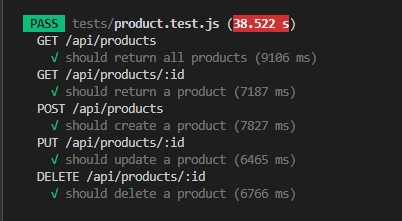

*for unit test*
- npm run test

*Api Test by Thunder client*

Open Thunder Client

1. GET: To retrieve a list of all products.
Set the Request URL:http://localhost:200/api/products/
Click the "Send"
Respond box will show all product in data base

2. GET by ID: To retrieve a product by its unique ID.
Set the Request URL:http://localhost:200/api/products/{productID}

3. POST: To add a new product.
Set the Request URL:http://localhost:200/products/
Input data : slect Body
=>Jason example input 
{
    "name": "TEST_TEST_22",
    "price": 999999999,
    "description": "asasasererasa"
}

4. PUT: To update an existing product.
Set the Request URL:http://localhost:200/api/products/{productID}

5. Delete : To remove a product from the database.
Set the Request URL:http://localhost:200/api/products/{productID}

